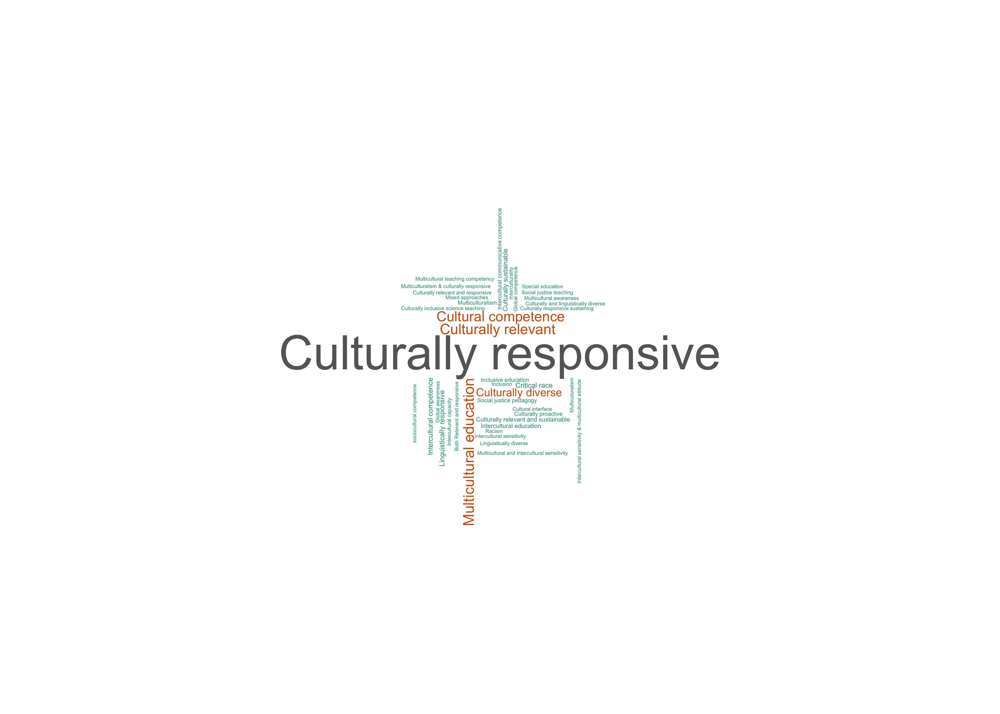

Quantitative and Qualitative Data Visualization
================
Faisal Mustafa,
November 7, 2025 (Updated on November 07, 2025)

- [WordCoud](#wordcoud)
- [Including Code](#including-code)
- [Including Plots](#including-plots)

## WordCoud

WordCloud can be used to dhow the trend in the data. For this purpose,
let’s use the data that from ……

``` r
df_wordcloud <- read.csv("https://faisalmustafa.github.io/data_visualization/data/nguyen2026.csv")
```

``` r
head(df_wordcloud)
```

    ##   X                                x
    ## 1 1            Culturally responsive
    ## 2 2 Culturally responsive sustaining
    ## 3 3         Intercultural competence
    ## 4 4         sociocultural competence
    ## 5 5                  Multicuturalism
    ## 6 6            Culturally responsive

Next, let’s create a frequency table based on the data, and remove
record containing *Not Applicable*.

``` r
library(dplyr)
tb <- as.data.frame(table(df_wordcloud$x)) %>% 
  filter(Var1 != "Not Applicable")
```

``` r
head(tb)
```

    ##                                    Var1 Freq
    ## 1          Both Relevent and responsive    1
    ## 2                         Critical race    5
    ## 3                   Cultural competence   20
    ## 4                    Cultural interface    1
    ## 5 Culturally and linguistically diverse    1
    ## 6                    Culturally diverse   14

Now we are ready to create a Word Cloud based on the data. In this
instance, let’s use `wordcloud` package.

``` r
library(wordcloud)
```

<!-- -->

To save the image into a file (e.g., PNG) and adjust its size and
resolution, enclose the above code with two lines below:

``` r
png(filename="wordcloud.png", width=30, height=30, units="cm", res = 600)

wordcloud(words = tb$Var1 , freq = tb$Freq, scale=c(2,0.2), min.freq = 1,
          max.words=100, random.order=FALSE, rot.per=0.35,
          colors= RColorBrewer::brewer.pal(8, "Dark2"))

dev.off()
```

## Including Code

You can include R code in the document as follows:

``` r
summary(cars)
```

    ##      speed           dist       
    ##  Min.   : 4.0   Min.   :  2.00  
    ##  1st Qu.:12.0   1st Qu.: 26.00  
    ##  Median :15.0   Median : 36.00  
    ##  Mean   :15.4   Mean   : 42.98  
    ##  3rd Qu.:19.0   3rd Qu.: 56.00  
    ##  Max.   :25.0   Max.   :120.00

## Including Plots

You can also embed plots, for example:

<!-- -->

Note that the `echo = FALSE` parameter was added to the code chunk to
prevent printing of the R code that generated the plot.
